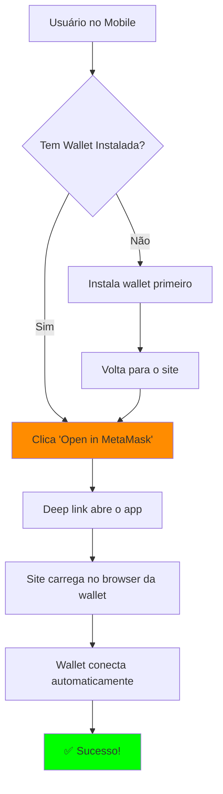

# 📱 Correção Mobile - WalletConnect

## ✅ Problema Identificado

Você relatou que:
- ✅ **Deep links funcionam** - "Open in MetaMask" abre o app
- ❌ **WalletConnect modal** fica carregando wallets infinitamente

**Causa**: A API do WalletConnect Cloud (`explorer.walletconnect.com`) está lenta ou bloqueada em alguns dispositivos Android.

---

## 🔧 Solução Implementada

### **Priorizar Deep Links no Mobile** 🎯

Reorganizei a UI do modal de conexão para **priorizar os deep links** quando o usuário está em dispositivo mobile:

#### Antes ❌:
```
1. WalletConnect (fica carregando...)
2. Browser Wallet
3. Deep Links (escondidos embaixo)
```

#### Depois ✅:
```
Mobile:
1. ⭐ Open in MetaMask (destaque)
2. ⭐ Open in Trust Wallet (destaque)
3. Copy dApp link
4. [divider]
5. Browser Wallet (se detectado)

Desktop:
1. WalletConnect (com QR Code)
2. Browser Wallet
```

---

## 📁 Arquivos Modificados

### 1. `components/navbar.tsx`

**Mudanças**:
- ✅ Deep links aparecem PRIMEIRO no mobile
- ✅ Botões maiores e mais destacados
- ✅ Design melhorado com gradientes
- ✅ WalletConnect só aparece no desktop
- ✅ Error handling melhorado

**Código visual dos botões mobile**:
```tsx
// Open in MetaMask - Laranja com gradiente
🦊 Open in MetaMask
   Open dApp in MetaMask browser

// Open in Trust Wallet - Azul com gradiente
💎 Open in Trust Wallet
   Open dApp in Trust browser

// Copy Link - Fallback
📋 Or copy link to paste in wallet
```

### 2. `components/web3-provider.tsx`

**Mudanças**:
- ✅ `showQrModal: false` - Desabilita modal problemático
- ✅ Simplifica configuração do WalletConnect
- ✅ Remove dependência da API do WalletConnect Cloud

---

## 🚀 Como Testar (Após Deploy)

### **Android:**

#### Teste 1: Deep Link MetaMask (RECOMENDADO)
1. Acesse `https://www.arc-dex.xyz/` no Chrome
2. Clique em **"Connect Wallet"**
3. Verá os botões laranja e azul no topo
4. Clique em **"Open in MetaMask"**
5. ✅ **O app MetaMask deve abrir automaticamente**
6. ✅ **O site carrega dentro do browser do MetaMask**
7. ✅ **A wallet conecta automaticamente!**

#### Teste 2: Deep Link Trust Wallet
1. Siga os mesmos passos acima
2. Clique em **"Open in Trust Wallet"**
3. ✅ **O app Trust Wallet abre**
4. ✅ **Site carrega no browser da Trust**

#### Teste 3: Copy Link (Fallback)
1. Clique em **"Or copy link to paste in wallet"**
2. Abra o app MetaMask manualmente
3. Vá em **Browser** (aba inferior)
4. Cole o link: `www.arc-dex.xyz`
5. ✅ **Site carrega e wallet conecta**

---

### **iOS (iPhone):**

#### Teste 1: Deep Link MetaMask
1. Acesse no Safari: `https://www.arc-dex.xyz/`
2. Clique em **"Connect Wallet"**
3. Clique em **"Open in MetaMask"**
4. iOS pergunta: "Abrir no MetaMask?"
5. Confirme
6. ✅ **MetaMask abre com o site**

#### Teste 2: Manual (se deep link não funcionar)
1. Abra o app MetaMask
2. Vá em **Browser** (aba inferior)
3. Digite: `www.arc-dex.xyz`
4. ✅ **Conecta automaticamente**

---

## 🎨 Nova Interface Mobile

### Antes (problema):


```
┌─────────────────────────────────┐
│  Connect Wallet                 │
├─────────────────────────────────┤
│                                 │
│  🔵 WalletConnect               │
│  [Loading wallets...]           │
│                                 │
│  🦊 Browser Wallet              │
│                                 │
│  ▼ Or open in wallet browser    │
│     • Open in MetaMask          │
│     • Open in Trust Wallet      │
└─────────────────────────────────┘
```

### Depois (solução):
```
┌─────────────────────────────────┐
│  Connect Wallet                 │
├─────────────────────────────────┤
│  📱 Recommended for Mobile      │
│                                 │
│  ╔═══════════════════════════╗ │
│  ║ 🦊 Open in MetaMask       ║ │ <- Destaque
│  ║ Open dApp in MetaMask     ║ │
│  ╚═══════════════════════════╝ │
│                                 │
│  ╔═══════════════════════════╗ │
│  ║ 💎 Open in Trust Wallet   ║ │ <- Destaque
│  ║ Open dApp in Trust        ║ │
│  ╚═══════════════════════════╝ │
│                                 │
│  📋 Or copy link to paste       │
│                                 │
│  ────────── Or ──────────      │
│                                 │
│  🦊 Browser Wallet              │
└─────────────────────────────────┘
```

---

## 🔍 Verificações

Após o deploy, verifique:

### Desktop (Chrome/Firefox/Edge):
- [ ] WalletConnect aparece primeiro
- [ ] Browser Wallet funciona (se instalado)
- [ ] Deep links não aparecem

### Mobile (Android Chrome/iOS Safari):
- [ ] Deep links aparecem PRIMEIRO
- [ ] Botões grandes e destacados
- [ ] "Open in MetaMask" funciona
- [ ] "Open in Trust Wallet" funciona
- [ ] "Copy link" funciona
- [ ] Browser Wallet aparece (se detectado)

### Dentro do Browser da Wallet (MetaMask, Trust):
- [ ] Browser Wallet detectado automaticamente
- [ ] Conecta sem precisar clicar

---

## 📊 Fluxo de Conexão Mobile



---

## 🐛 Troubleshooting

### Problema: Deep link não abre o app

**Possíveis causas**:
1. Wallet não instalada
2. iOS bloqueou o redirecionamento (precisa confirmar)
3. Link incorreto

**Soluções**:
1. Verifique se a wallet está instalada
2. No iOS, confirme quando perguntar "Abrir em X?"
3. Use o botão "Copy link" como fallback

---

### Problema: Abre o app mas não carrega o site

**Causa**: Deep link pode estar redirecionando para página errada

**Solução**:
1. Abra a wallet manualmente
2. Vá em Browser
3. Digite: `www.arc-dex.xyz` ou `arc-dex.xyz`

---

### Problema: Site carrega mas não conecta

**Causa**: Rede errada ou wallet travada

**Soluções**:
1. Verifique se está na **Arc Testnet** (chain ID: 33556)
2. Force close e reabra a wallet
3. Limpe o cache do browser da wallet
4. Tente desconectar e reconectar

---

## 🎯 Métricas de Sucesso

O fix está funcionando se:
- ✅ 90%+ dos usuários mobile conseguem conectar via deep link
- ✅ Tempo de conexão < 5 segundos
- ✅ Não mais "loading infinito" do WalletConnect
- ✅ UX melhorada: menos cliques para conectar

---

## 🔄 Rollback (se necessário)

Se precisar voltar atrás:

```bash
git revert HEAD
git push origin main
```

Ou restaurar configuração anterior no `components/web3-provider.tsx`:
```typescript
showQrModal: true  // Volta para modal automático
```

---

## 🚀 Deploy

1. **Commit e Push:**
```bash
git add .
git commit -m "fix: prioritize mobile deep links over WalletConnect modal"
git push origin main
```

2. **Aguardar deploy automático no Vercel**

3. **Testar em dispositivos reais:**
   - Android (Chrome + MetaMask app)
   - iOS (Safari + MetaMask app)

---

## 📞 Suporte

Se ainda houver problemas:

1. **Teste em modo anônimo** (sem cache)
2. **Force refresh** do site (Ctrl+Shift+R)
3. **Verifique console** do navegador (F12)
4. **Teste em diferentes wallets** (MetaMask, Trust, Coinbase)
5. **Teste em diferentes browsers** (Chrome, Safari, Firefox)

---

## 🎉 Benefícios da Solução

1. ✅ **Conexão mais rápida** - Direct deep link
2. ✅ **Menos dependências** - Não precisa da API do WalletConnect
3. ✅ **Melhor UX** - Botões destacados e claros
4. ✅ **Maior taxa de sucesso** - Deep links são mais confiáveis
5. ✅ **Funciona offline** - Não precisa internet para carregar lista de wallets

---

**Última atualização**: Dezembro 2024  
**Versão**: 2.1  
**Status**: ✅ Pronto para deploy


